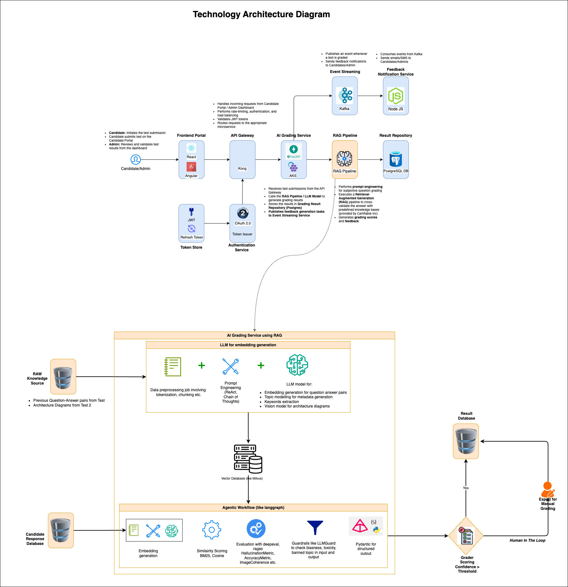

# Technology Architecture Document

## 📌 Introduction
Certifiable Inc. is undergoing a modernization initiative to enhance its **certification and assessment platform**. This architecture leverages AI-driven **automated grading, secure authentication, and scalable event-driven processing**, ensuring a **robust, efficient, and intelligent** certification experience.

---

## 🏗️ System Overview

The architecture consists of **multiple integrated services** working together seamlessly:

- **Candidate & Admin Portal** – Built with **Angular**, provides test registration, submissions, and result tracking.
- **API Gateway** – **Kong** manages incoming requests, ensuring **secure and controlled** access.
- **AI Grading Service** – Uses **Retrieval-Augmented Generation (RAG)** with **LLMs** to **evaluate test answers, diagrams, and code submissions**.
- **RAG Pipeline** – Handles embedding generation, prompt engineering, and vector database storage.
- **Event Streaming & Processing** – Kafka publishes events for test submissions and notifications.
- **Database & Repository** – PostgreSQL stores structured grading results.
- **Notification Service** – **Node.js-based feedback system** ensures real-time updates.
- **Human-in-the-loop Mechanism** – Ensures **accuracy with manual review** for borderline cases.

---

## 🔄 Workflow Breakdown

1️⃣ **Candidate submits test** via frontend portal.
2️⃣ **API Gateway (Kong)** authenticates and routes the request.
3️⃣ **AI Grading Service** fetches test data & processes it using:
- **LLM-based RAG pipeline** for **text/code/diagram evaluation**.
- **Vector database** for similarity-based scoring.
- **Guardrails for AI-generated outputs** to prevent bias.
  4️⃣ **Results stored in PostgreSQL**.
  5️⃣ **Event triggers Kafka message**, notifying:
- Candidates (via email, app notifications)
- Admin dashboard for monitoring
- Hiring companies for score verification
  6️⃣ **Final grading threshold check**: AI-passed or escalated for manual review.
  7️⃣ **Results published in the portal** with insights & analytics.

---

## 🛠️ Tech Stack

| Layer | Technology Used |
|-------|----------------|
| Frontend | Angular, JWT Auth |
| API Gateway | Kong API Gateway |
| Authentication | OAuth 2.0, JWT Tokens |
| AI Grading Service | OpenAI LLMs, Vector DB (Milvus) |
| RAG Pipeline | Text & Image Embeddings, Prompt Engineering |
| Event Processing | Kafka, Event Grid |
| Database | PostgreSQL |
| Notification | Node.js, WebSockets |
| Monitoring | AI Performance Logs, System Analytics |

---

## 🚀 Future Enhancements
- **Adaptive AI Models** – Train models for specific subject domains.
- **Integration with Hiring Portals** – Enable companies to validate scores directly.
- **Blockchain for Certification** – Immutable, tamper-proof credential verification.
- **Gamification & Insights** – AI-powered personalized learning feedback.

📌 **This architecture ensures Certifiable Inc. stays ahead in the AI-driven certification landscape, improving efficiency, accuracy, and scalability!** 🚀

---*Added by Data Arch Evanglist Team For Winter 2025 Kata: Architecture & AI on 17th March 2025*
