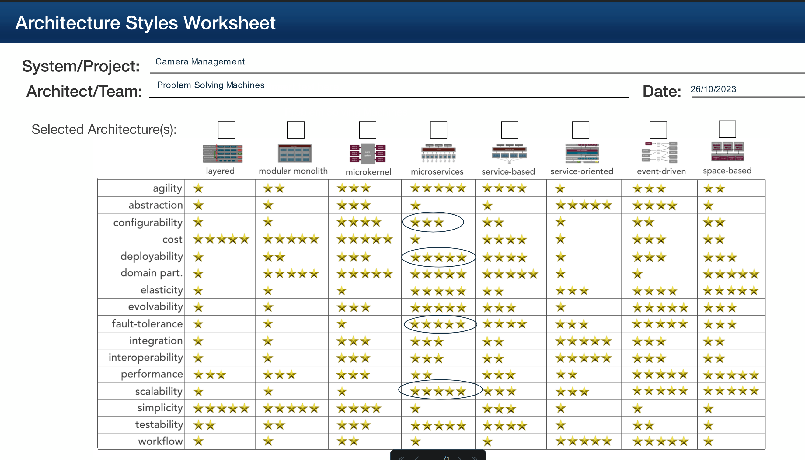

# Camera Management

Once a camera is setup, the end user will need to interact with it, including
modifying settings that would aid in capturing footage.

## Responsibilities

- Provide list of cameras
- Provide an overview of a camera, including its settings

