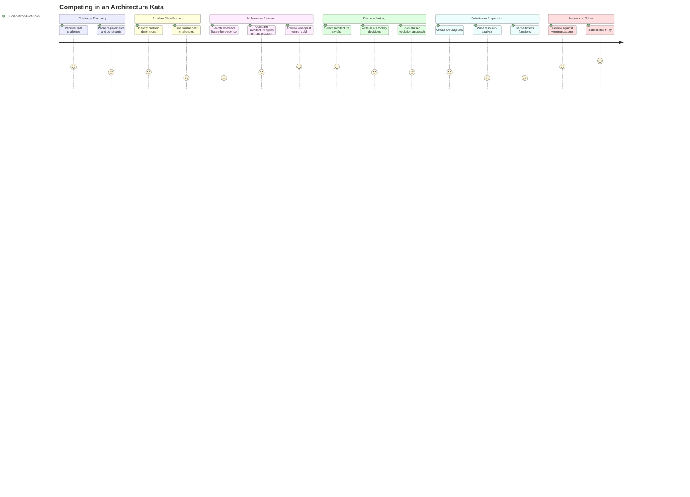

# Competing in an Architecture Kata

## Persona

[PERSONA-001: The Kata Competitor](../../persona/(PERSONA-001)-The-Kata-Competitor/(PERSONA-001)-The-Kata-Competitor.md) — a developer or architect competing in an O'Reilly Architecture Kata, looking for evidence to guide their submission.

## Goal

Produce a winning kata submission by making evidence-backed architecture decisions and documenting them rigorously within the 1-2 week competition window.

## Steps / Stages

### 1. Challenge Discovery

The competitor receives the kata challenge and reads the requirements. They parse the problem statement for domain constraints, quality attributes, scale expectations, and evaluation hints. At this point they have questions but no clear direction.

### 2. Problem Classification

The competitor maps their challenge against known problem dimensions — domain type, scale, compliance needs, integration complexity, real-time requirements, edge/offline, AI/ML involvement, greenfield vs. brownfield, and the key architectural tension. They want to find past challenges that look similar to theirs.

### 3. Architecture Research

The competitor searches the reference library for evidence. They look up what styles won for similar problem profiles, what quality attributes correlate with placement, and what documentation practices winners used. This is where the library provides its highest value — but only if the competitor can find relevant evidence quickly.

### 4. Decision Making

Armed with evidence, the competitor selects their architecture style(s) and begins documenting ADRs. They choose complementary patterns (winners average 2+ styles), prioritize quality attributes based on evidence rather than instinct, and plan a phased evolution from MVP to target state.

### 5. Submission Preparation

The competitor creates C4 diagrams, writes a feasibility analysis, defines fitness functions, and assembles their final submission. This is the most time-pressured stage — documentation quality matters (ADR count is the second-strongest predictor of placement) but competes with design time.

### 6. Review and Submit

The competitor reviews their submission against the "winning formula" (15+ ADRs, feasibility analysis, hybrid style, phased evolution) and submits.

## Pain Points

- **Finding similar past challenges (score: 2).** There is no structured way to ask "which past katas had a similar problem profile?" The competitor must manually browse challenge analyses and hope to find a match.
- **Searching the reference library (score: 2).** The reference library is organized by concept (problem spaces, solution spaces, evidence) rather than by workflow. A competitor under time pressure needs answers, not a research methodology.
- **Writing feasibility analysis (score: 2).** This is the highest-leverage documentation artifact (4.5x more likely to place top-2) but competitors don't know that — and there is limited guidance on what a good feasibility analysis looks like beyond the template.
- **Defining fitness functions (score: 2).** Only 17% of teams include fitness functions, but 55% of winners do. Competitors lack examples and patterns for translating quality attributes into falsifiable, quantitative targets.

## Opportunities

- **Guided problem classification.** A decision-navigator flow that asks structured questions and maps to similar past challenges would dramatically reduce research time.
- **Winning formula checklist.** Surface the key statistical findings (ADR count, feasibility analysis, fitness functions, hybrid styles) as an actionable checklist that competitors can work through.
- **Feasibility analysis examples.** Include annotated examples from winning teams in the templates directory.
- **Architecture-advisor skill integration.** Let competitors ask questions in natural language and get evidence-backed answers without leaving their development environment.

## Lifecycle

| Phase | Date | Commit | Notes |
|-------|------|--------|-------|
| Draft | 2026-03-03 | 6883447 | Initial creation — derived from dataset analysis and reference library structure |
| Abandoned | 2026-03-11 | — | Not relevant to VISION-001 direction |
