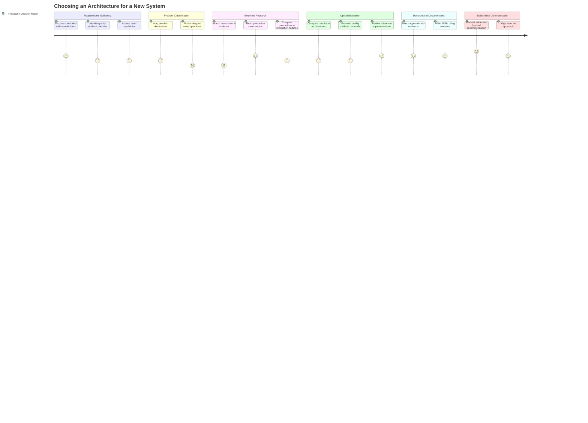

# Choosing an Architecture for a New System

## Persona

[PERSONA-002: The Practicing Architect](../../../persona/Active/(PERSONA-002)-The-Practicing-Architect/(PERSONA-002)-The-Practicing-Architect.md) — a senior developer or architect making production architecture decisions, looking for empirical grounding.

## Goal

Select and justify an architecture approach for a new production system based on evidence from real projects, not opinion or hype.

## Steps / Stages

### 1. Requirements Gathering

The architect works with stakeholders to understand business constraints, quality attribute priorities, team capabilities, and timeline. They have a rough sense of the problem but haven't committed to an approach.

### 2. Problem Classification

The architect maps their system's characteristics against known problem dimensions — scale, compliance, integration complexity, real-time needs, domain type. They want to understand how their problem relates to problems that have been solved before.

### 3. Evidence Research

The architect searches the reference library for relevant evidence. They look at cross-source comparisons (competition vs. production vs. reference architectures), per-style evidence tables, and production case studies. They want to know: "For problems like mine, what approaches have actually worked — and what has failed?"

### 4. Option Evaluation

The architect compares 2-3 candidate architecture styles using evidence-based criteria. They weigh quality attribute trade-offs, look at pairing patterns (which styles complement each other), and evaluate maturity signals from reference implementations.

### 5. Decision and Documentation

The architect selects an approach and documents it in ADRs — recording alternatives considered, evidence consulted, and rationale. The evidence from the reference library gives them concrete data points to cite rather than relying on "I think" or "the industry says."

### 6. Stakeholder Communication

The architect presents their recommendation to leadership and the engineering team. Evidence-backed recommendations ("73% of winners used hybrid approaches; Modular Monolith has the highest per-team success rate at 3.0/4.0") are more persuasive than appeals to authority or convention.

## Pain Points

- **Finding analogous solved problems (score: 2).** The problem-solution matrix maps problem dimensions to architecture styles, but the architect needs to know "has anyone built something like what I'm building?" — not just "what style fits this dimension." The current library lacks domain-specific filtering.
- **Searching cross-source evidence (score: 2).** Evidence is spread across five sources with different formats, depths, and coverage areas. There is no unified search or comparison view. The cross-source reference table exists but is dense and requires significant interpretation.

## Opportunities

- **Unified search across evidence sources.** Let the architect describe their problem and get relevant evidence from all five sources, ranked by relevance.
- **Domain-specific filtering.** The evidence base spans healthcare, logistics, civic tech, travel, IoT, AI, retail, and more. Let architects filter by domain vertical.
- **Production-first evidence.** Distinguish competition evidence (what was proposed) from production evidence (what actually ran) to help architects calibrate their confidence.
- **Architecture-advisor skill.** The most direct opportunity — let the architect ask questions and get evidence-backed answers within their workflow, without needing to navigate the reference library manually.
- **Comparative reference architectures.** Link from each architecture style's evidence table to working reference implementations the architect can inspect and learn from.

## Lifecycle

| Phase | Date | Commit | Notes |
|-------|------|--------|-------|
| Draft | 2026-03-03 | 6883447 | Initial creation — derived from reference library structure and skill design proposal |
| Validated | 2026-03-04 | 0cc423c | Journey confirmed through iterative design work on architecture advisor skill |
