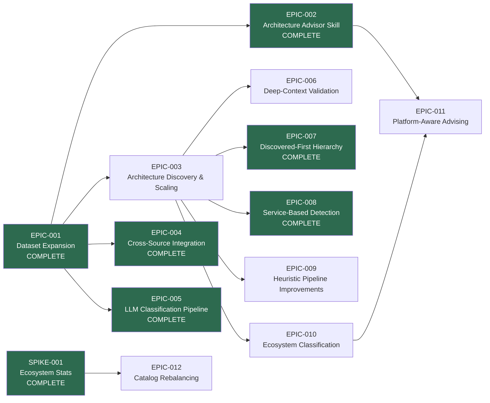

# Roadmap

_Supporting document for [VISION-001](./(VISION-001)-Evidence-Based-Architecture-Decision-Platform.md)_

## Epic Sequencing

## Status

| Epic | Phase | Goal | Dependencies |
|------|-------|------|--------------|
| [EPIC-001](../../epic/(EPIC-001)-Dataset-Expansion-and-Evidence-Enrichment/(EPIC-001)-Dataset-Expansion-and-Evidence-Enrichment.md) | **Complete** | Expand evidence base to 4 sources with 62 cataloged projects | None |
| [EPIC-002](../../epic/(EPIC-002)-Architecture-Advisor-Skill/(EPIC-002)-Architecture-Advisor-Skill.md) | **Complete** | Ship a remote-installable agent skill exposing the evidence library | Built on EPIC-001 |
| [EPIC-003](../../epic/(EPIC-003)-Architecture-Discovery-and-Scaling/(EPIC-003)-Architecture-Discovery-and-Scaling.md) | **Active** | Build discovery tooling and scale to 200+ projects | Builds on EPIC-001 and EPIC-002 |
| [EPIC-004](../../epic/(EPIC-004)-Cross-Source-Reference-Library-Integration/(EPIC-004)-Cross-Source-Reference-Library-Integration.md) | **Complete** | Rewrite reference library docs to synthesize evidence from all 5 sources | Builds on EPIC-001 |
| [EPIC-005](../../epic/(EPIC-005)-LLM-Classification-Pipeline/(EPIC-005)-LLM-Classification-Pipeline.md) | **Complete** | Automate Pass 2 LLM review of Indeterminate entries | Builds on EPIC-003 |
| [EPIC-006](../../epic/(EPIC-006)-Deep-Context-Classification-Validation/(EPIC-006)-Deep-Context-Classification-Validation.md) | Proposed | Re-validate all classifications with deep context | Builds on EPIC-003 |
| [EPIC-007](../../epic/(EPIC-007)-Discovered-First-Evidence-Hierarchy/(EPIC-007)-Discovered-First-Evidence-Hierarchy.md) | **Complete** | Restructure reference library docs to lead with Discovered evidence | Builds on EPIC-003 |
| [EPIC-008](../../epic/Complete/(EPIC-008)-Service-Based-Architecture-Detection/(EPIC-008)-Service-Based-Architecture-Detection.md) | **Complete** | Fix Service-Based and Plugin/Microkernel detection blind spots | Builds on EPIC-003 |
| [EPIC-009](../../epic/Proposed/(EPIC-009)-Heuristic-Pipeline-Improvements/(EPIC-009)-Heuristic-Pipeline-Improvements.md) | Proposed | Improve heuristic pipeline to 60%+ agreement with deep-validation | Builds on SPEC-019 |
| [EPIC-010](../../epic/Proposed/(EPIC-010)-Ecosystem-Architecture-Classification/(EPIC-010)-Ecosystem-Architecture-Classification.md) | Proposed | Capture cross-repo ecosystem architecture patterns | Builds on SPEC-019 |
| [EPIC-011](../../epic/Proposed/(EPIC-011)-Platform-Aware-Architecture-Advising/(EPIC-011)-Platform-Aware-Architecture-Advising.md) | Proposed | Enhance advisor skill to distinguish platform vs application contexts | Builds on EPIC-002, EPIC-010 |
| [EPIC-012](../../epic/Active/(EPIC-012)-Catalog-Rebalancing-and-Application-Expansion/(EPIC-012)-Catalog-Rebalancing-and-Application-Expansion.md) | **Active** | Remove 43 non-architecture entries, add 30+ applications, recompute rankings | Builds on SPIKE-001, ADR-001 |

## Research Dependencies

| Research | Gate For | Status |
|----------|----------|--------|
| [SPIKE-001](../../research/Complete/(SPIKE-001)-Ecosystem-Statistical-Modeling/(SPIKE-001)-Ecosystem-Statistical-Modeling.md) | EPIC-010, EPIC-011 | **Complete** |
| [SPIKE-002](../../research/Planned/(SPIKE-002)-Classification-Taxonomy-Expansion/(SPIKE-002)-Classification-Taxonomy-Expansion.md) | EPIC-009, EPIC-010 | Planned |
