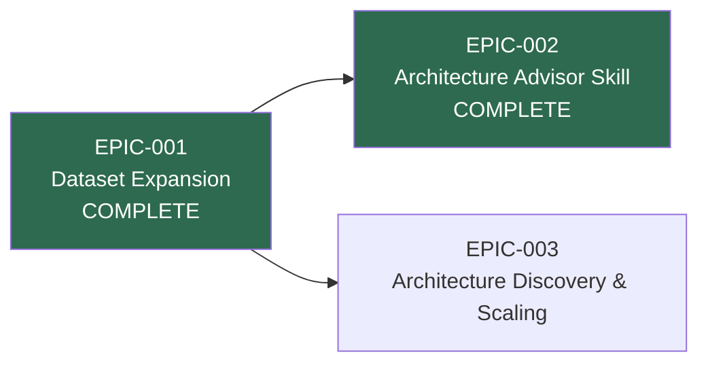

# Roadmap

_Supporting document for [VISION-001](./(VISION-001)-Evidence-Based-Architecture-Decision-Platform.md)_

## Epic Sequencing

EPIC-001 and EPIC-002 are complete. EPIC-003 (discovery tooling and dataset scaling) is the remaining work — it builds on both the expanded evidence base (EPIC-001) and could leverage the advisor skill's infrastructure (EPIC-002).

## Status

| Epic | Phase | Goal | Dependencies |
|------|-------|------|--------------|
| [EPIC-001](../../epic/(EPIC-001)-Dataset-Expansion-and-Evidence-Enrichment/(EPIC-001)-Dataset-Expansion-and-Evidence-Enrichment.md) | **Complete** | Expand evidence base to 4 sources with 62 cataloged projects | None |
| [EPIC-002](../../epic/(EPIC-002)-Architecture-Advisor-Skill/(EPIC-002)-Architecture-Advisor-Skill.md) | **Complete** | Ship a remote-installable agent skill exposing the evidence library | Built on EPIC-001 |
| [EPIC-003](../../epic/(EPIC-003)-Architecture-Discovery-and-Scaling/(EPIC-003)-Architecture-Discovery-and-Scaling.md) | Proposed | Build discovery tooling and scale to 200+ projects | Builds on EPIC-001 and EPIC-002 |
