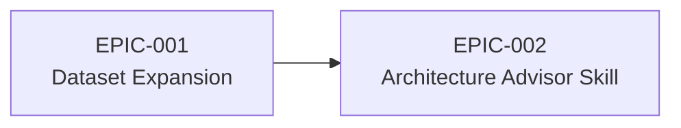

# Roadmap

_Supporting document for [VISION-001](./\(VISION-001\)-Evidence-Based-Architecture-Decision-Platform.md)_

## Epic Sequencing

EPIC-002 benefits from EPIC-001's expanded evidence base but does not strictly block on it — the advisor skill can launch with the current dataset and improve as more sources are integrated.

## Status

| Epic | Phase | Goal | Dependencies |
|------|-------|------|--------------|
| [EPIC-001](../../epic/\(EPIC-001\)-Dataset-Expansion-and-Evidence-Enrichment/\(EPIC-001\)-Dataset-Expansion-and-Evidence-Enrichment.md) | Proposed | Expand evidence base from 78 to 200+ projects across 4+ sources | None |
| [EPIC-002](../../epic/\(EPIC-002\)-Architecture-Advisor-Skill/\(EPIC-002\)-Architecture-Advisor-Skill.md) | Proposed | Ship a remote-installable agent skill exposing the evidence library | Soft dependency on EPIC-001 |
