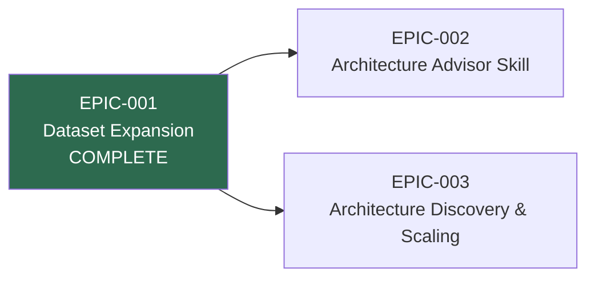

# Roadmap

_Supporting document for [VISION-001](./\(VISION-001\)-Evidence-Based-Architecture-Decision-Platform.md)_

## Epic Sequencing

EPIC-001's expanded evidence base feeds both EPIC-002 (advisor skill) and EPIC-003 (discovery/scaling). EPIC-002 and EPIC-003 are independent of each other — the advisor skill can launch with the current 4-source dataset, and the discovery skill can scale the dataset without the advisor skill existing.

## Status

| Epic | Phase | Goal | Dependencies |
|------|-------|------|--------------|
| [EPIC-001](../../epic/\(EPIC-001\)-Dataset-Expansion-and-Evidence-Enrichment/\(EPIC-001\)-Dataset-Expansion-and-Evidence-Enrichment.md) | **Complete** | Expand evidence base to 4 sources with 62 cataloged projects | None |
| [EPIC-002](../../epic/\(EPIC-002\)-Architecture-Advisor-Skill/\(EPIC-002\)-Architecture-Advisor-Skill.md) | Proposed | Ship a remote-installable agent skill exposing the evidence library | Soft dependency on EPIC-001 (complete) |
| [EPIC-003](../../epic/\(EPIC-003\)-Architecture-Discovery-and-Scaling/\(EPIC-003\)-Architecture-Discovery-and-Scaling.md) | Proposed | Build discovery tooling and scale to 200+ projects | Builds on EPIC-001 (complete) |
