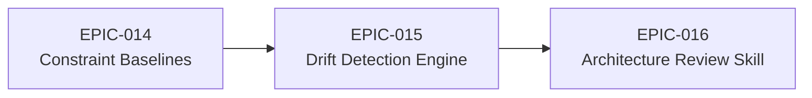

# Roadmap

_Supporting document for [VISION-002](./(VISION-002)-Architecture-Review-and-Drift-Detection.md)_

## Epic Sequencing

## Status

| Epic | Phase | Goal | Dependencies |
|------|-------|------|--------------|
| [EPIC-014](../../../epic/Active/(EPIC-014)-Architecture-Style-Constraint-Baselines/(EPIC-014)-Architecture-Style-Constraint-Baselines.md) | **Active** | Derive per-style structural expectations from the evidence base | None |
| [EPIC-015](../../../epic/Proposed/(EPIC-015)-Drift-Detection-Engine/(EPIC-015)-Drift-Detection-Engine.md) | **Proposed** | Compare discovered structure against baselines, produce grounded drift findings | EPIC-014 |
| [EPIC-016](../../../epic/Proposed/(EPIC-016)-Architecture-Review-Skill/(EPIC-016)-Architecture-Review-Skill.md) | **Proposed** | Installable skill orchestrating the full review workflow with annotated reports | EPIC-015 |
